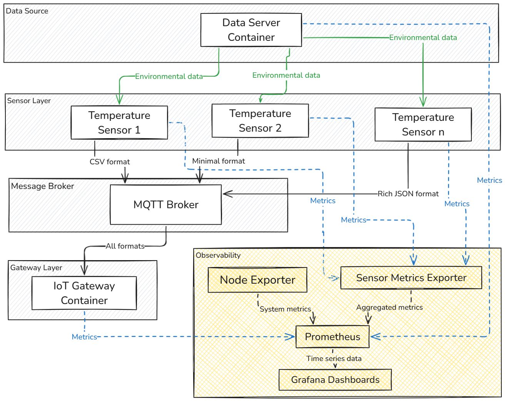

# Containerization for Reproducibility

## Overview

The VAST framework's containerized architecture provides a reproducible security testbed that can be easily deployed across diverse environments with minimal configuration overhead. This document details the containerization strategy and observability stack that enable consistent experimentation and monitoring.

## Architecture Benefits

The entire framework is structured as a series of interconnected microservices, each implemented as a Docker container with well-defined interfaces. This architecture provides several key benefits:

### Consistent Environment
All components run in isolated containers with precisely defined dependencies, eliminating the "works on my machine" problem often encountered in complex IoT deployments. Each container has a specific Dockerfile that defines its exact environment, ensuring predictable behavior across different host systems.

### Scalability
Researchers can easily scale the number of sensor instances to simulate larger agricultural deployments. The `main.docker-compose.yaml` file enables configuration of multiple temperature sensors with different data formats through simple configuration changes:

```yaml
# Example from docker-compose.yaml showing sensor scaling
services:
  temperature-sensor-01:
    image: vast-temperature-sensor
    environment:
      - SENSOR_ID=TEMP001
      - DATA_FORMAT=binary
    # ... other configuration

  temperature-sensor-02:
    image: vast-temperature-sensor
    environment:
      - SENSOR_ID=TEMP002
      - DATA_FORMAT=csv
    # ... other configuration
```

### Component Isolation
Security testing can target specific components (sensors, gateway, data server) without affecting the entire system, allowing for precise vulnerability analysis. This isolation enables researchers to introduce targeted attacks or faults without disrupting the entire ecosystem.

### Resource Control
Each container has defined resource limits, preventing resource exhaustion attacks from impacting the host system. For example, sensor containers can be constrained to specific CPU and memory allocations:

```yaml
# Example resource constraints
services:
  temperature-sensor-01:
    # ... other configuration
    deploy:
      resources:
        limits:
          cpus: '0.25'
          memory: 100M
```

## Multi-layered Design

The multi-layered design intentionally replicates real-world agricultural IoT deployments, with data flowing from the Data Server through the Temperature Sensors and MQTT broker to the IoT Gateway. This architecture allows researchers to study how vulnerabilities propagate through different system layers.



## Integrated Observability Stack

A key innovation in the VAST framework is the comprehensive observability stack that provides real-time insights into system behavior during both normal operation and attack scenarios.

### Prometheus
Collects time-series metrics from all system components, with custom exporters for sensor-specific data. The Prometheus configuration automatically discovers and scrapes metrics from all containers in the deployment.

### Grafana
Provides visualization dashboards for real-time monitoring of temperature readings, sensor health metrics, and resource utilization. Pre-configured dashboards include:

- Multi-sensor overview
- Single sensor detailed view
- Resource utilization
- Fault visualization
- Attack detection

### Node Exporter and cAdvisor
Capture system-level metrics to monitor container performance and resource usage, providing insights into how attacks impact system resources.

### Custom Sensor Metrics Exporter
Collects application-specific metrics including:
- Temperature variations
- Sensor fault modes
- Authentication events
- Request latency
- Error rates

## Deployment Instructions

The observability stack can be deployed separately from the main application stack:

```bash
# Deploy the main application
docker-compose -f main.docker-compose.yaml up -d

# Deploy the observability stack
docker-compose -f observability/docker-compose.yaml up -d
```

Access the monitoring interfaces at:
- Grafana: http://localhost:3000 (default credentials: admin/admin)
- Prometheus: http://localhost:9090

## Dashboard Examples

The observability stack enables detection of subtle security anomalies that might otherwise go unnoticed. During attack scenarios such as resource exhaustion attacks, Grafana dashboards clearly visualize the correlation between malicious activities and system behavior changes.

For specific dashboard configurations and examples, please refer to the `observability/grafana/dashboards` directory in the repository.