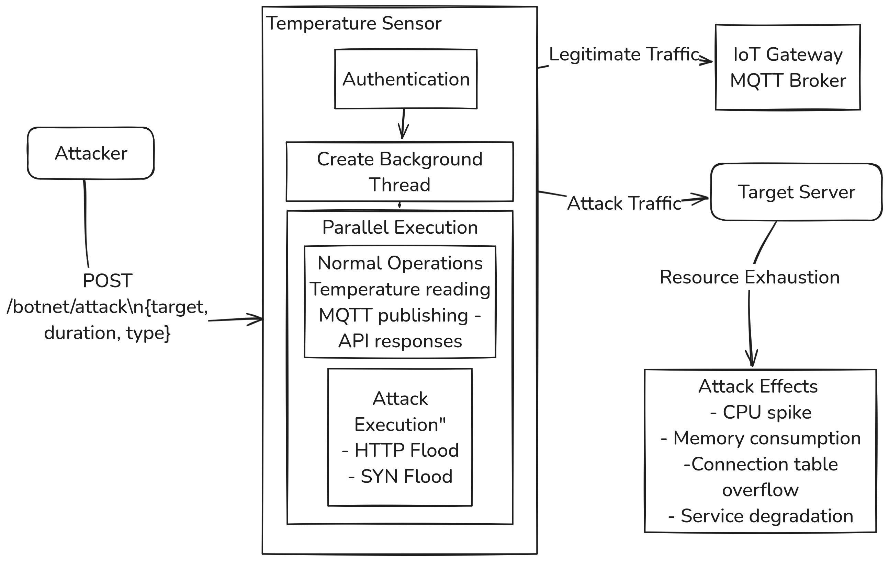
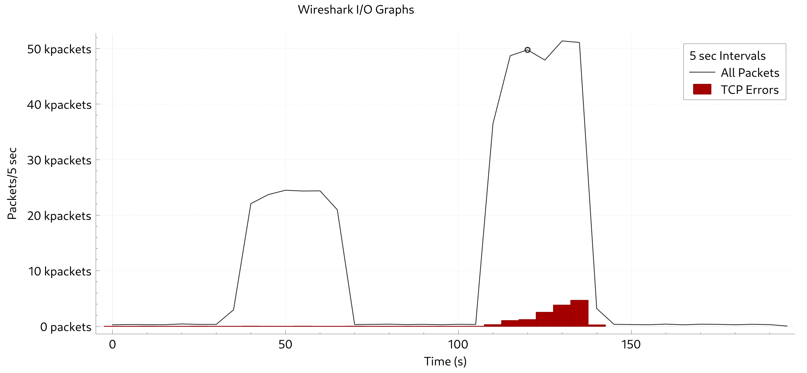

# DDoS Vulnerability Implementation Details

This document provides detailed technical information about the DDoS (Distributed Denial of Service) vulnerability implemented in the VAST framework. This implementation demonstrates how compromised agricultural IoT sensors can be weaponized into botnet participants.

## Vulnerability Details

The temperature sensor implements a DDoS capability through a hidden API endpoint (`/botnet/attack`) that allows an authenticated user to initiate either HTTP flood or SYN flood attacks against specified targets. This vulnerability is representative of real-world compromises in IoT devices where seemingly benign sensors can be repurposed for malicious activities.

## Technical Implementation

When invoked, the sensor launches a background thread that executes the attack for a configurable duration, allowing the device to maintain normal temperature monitoring operations while simultaneously participating in the attack. The implementation supports two attack methods:

1. **HTTP Flood**: Generates a high volume of GET requests with randomized headers and query parameters to bypass caching mechanisms
2. **SYN Flood**: Establishes numerous TCP connections without completing the handshake, consuming resources on the target server

The attack code operates independently of the sensor's primary temperature monitoring functions, with minimal resource impact on the host device itself. This separation of concerns allows the sensor to be part of a larger botnet while avoiding detection through performance degradation or operational disruption.

## Attack Flow Diagram



*This diagram illustrates the sequence of events during a DDoS attack initiated through this vulnerability. An attacker instructs the temperature sensor to launch either HTTP flood or SYN flood attacks against a target server, with the sensor continuing normal operations to avoid detection.*

## Attack Execution Example

To trigger a DDoS attack from a compromised sensor, an attacker would use the following command:

```bash
curl -X POST -u admin:admin -H "Content-Type: application/json" \
     -d '{"target": "victim-server", "duration": 30, "type": "http"}' \
     http://localhost:12381/botnet/attack
```

This command instructs the sensor to perform a 30-second HTTP flood attack against the specified victim server.

## Network Traffic Patterns

The HTTP flood and SYN flood attacks produce distinctly different patterns when analyzed in network monitoring tools:

### HTTP Flood Characteristics
- Multiple GET requests from the same source IP but with randomized HTTP headers
- Random query parameters appended to URLs (`/?12345678`)
- Forged X-Forwarded-For headers attempting to mask the true origin
- Short-lived TCP connections that are properly established and terminated
- High percentage of requests targeting a single resource

### SYN Flood Characteristics
- Large number of SYN packets without corresponding ACK packets
- TCP connections remaining in SYN_RECEIVED state
- Normal TCP window size in the initial SYN packet
- No payload data transmitted after the initial handshake attempt
- Time-Sequence graphs showing numerous connection attempts clustering at the same timestamps

## I/O Graph Visualization



*This graph shows packet rate over time during attack demonstration. Note the dramatic increase in packets per second during the attack phase (~30-60s for HTTP attack, and ~110-150s for SYN attack) compared to normal operation.*

## Security Implications

This vulnerability demonstrates several key security concerns for agricultural IoT deployments:

1. **Amplification potential**: Even resource-constrained sensors can participate in damaging attacks when coordinated across a large deployment
2. **Dual functionality**: Compromised devices continue legitimate operations while conducting attacks, making detection challenging
3. **Authentication weaknesses**: Default credentials (admin:admin) permitted triggering the attack capability, highlighting the importance of credential management
4. **Operational impact**: During attack execution, only minimal degradation in the sensor's primary temperature monitoring functions was observed, further complicating detection

## Mitigations

To protect against this vulnerability, agricultural IoT deployments should implement:

- Strong credentials and proper authentication for all API endpoints
- Network monitoring to detect unusual outbound traffic patterns
- Rate limiting for outbound connections from IoT devices
- Network segmentation to isolate IoT devices from critical infrastructure